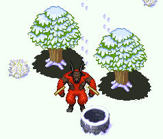

Tabany
======

<div id="container" style="text-align: center;">
  
</div>

Tabany is a free and open-source browser-based MMORPG written in JavaScript and implemented with Node.js.


Backstory
---------

"Tabany" is the informal name of the planet T.A.B.A.N.Y. (The Artificial Biological Anamoly Near You), which is the setting for the game. Geographically- and atmospherically-speaking, Tabany is Earth-like, and is inhabited by the descendants of a stranded band of intergalactic settlers. The planet was specially-engineered to preserve a state of perpetual infancy among its biological inhabitants, such that life could be lived simply and without technology's eccentricities.

However, due to an error in the planet's design, its age regresses at a rate faster than it progresses. The consequence of this is that all life on Tabany is completely destroyed after a period of seven days. But Tabany also has a fail-safe feature which will revitalize its inhabitants to their original state if a mass extinction ever occurs. So, every seven days, the planet is reborn.


Gameplay
--------

Players are dropped into a world in which they can interact with other players (in real-time) on an endless, seamless landscape. 

There are various Objectives which players can pursue over the course of the Tabanese Week. They can opt to band together in "clans" (of two to sixteen players) to better their chances of survival and success. Those who complete the Objectives are hailed as "W.I.N.N.E.R.S." at the Week's end. After the Week comes to a close, the planet is reset, and all players are on equal-footing once again. In this way the gameplay could be considered "session-based," albeit the sessions are rather long-lived.

The world is "partially-modifiable." Some areas are customizable for strategic or aesthetic purposes, and others are not at all (for the sake of mobility). Think "secret bases" from Pokémon Diamond and Pearl, but on a grander scale.

Players view themselves from a top-down perspective in the classic Final Fantasy / Zelda fashion. Exploration and environment will also feel similar to that of tilemap-based games, however players will be able to move pixel-by-pixel (breaking the bounds of tiles) and (in some cases) on multiple dimensions.


Status
------

Tabany is currently in a state of semi-active development.

The game engine is currently unstable and probably in need of some serious architecting and rewriting. Once the game's client- and server-side components are sufficiently-stabilized, this message will be updated. GitHub Releases will then provide stable versions of the software, which should allow anyone to run a game server on his own website (provided Node.js is installed, etc).

Performance will be scrutinized once all essential features of the engine are implemented.

Graphics are on the horizon; until then, the game will utilize RPG Maker assets (available under separate terms than that of Tabany's code).


Usage
-----

To install:

```bash
$ git clone https://github.com/jacksonrayhamilton/tabany.git
$ cd tabany
$ npm install
```

After installing, to run the server:

```bash
$ node app
```


Contact
-------

Send an email to jackson@jacksonrayhamilton.com if you would like to contribute to this project in any substantial \[or, I suppose, even in any *minor*\] way.


Image Credits
-------------

Credits for this project's image assets are available at public/images/CREDITS. These assets are NOT licensed under the same terms as Tabany's code. In order to use those assets you must follow the specific requirements of their creators, which are specified at the pages listed in CREDITS. Copying the CREDITS file into your project MAY suffice, but you should navigate to the creators' pages to confirm that you are properly crediting the creators.
